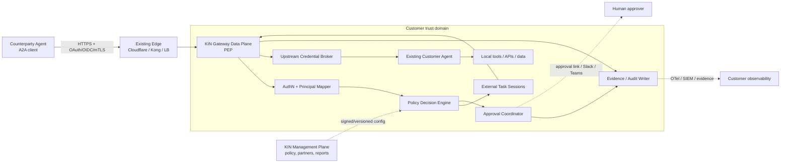
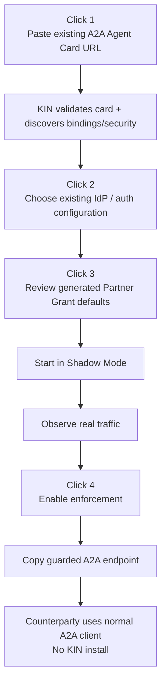
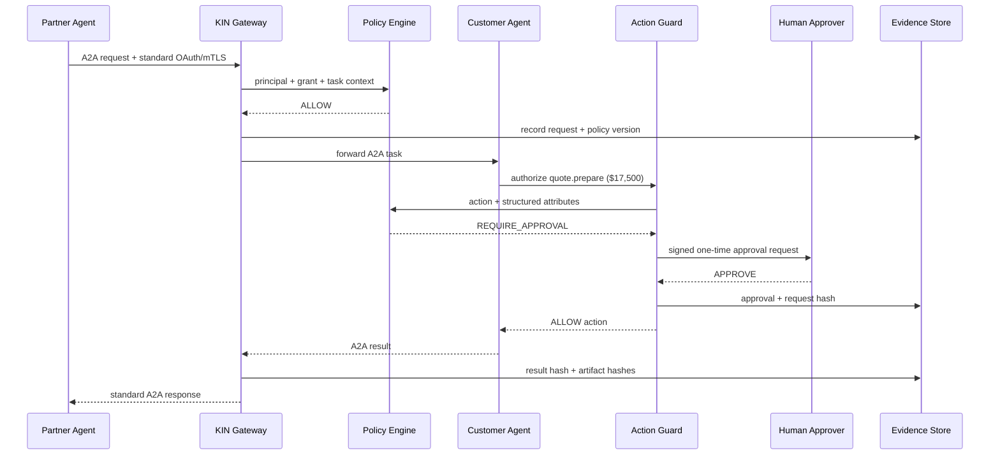

# KIN Gateway: Test-Driven Build Plan for the External Agent Control Layer

## Executive summary

The technically credible pivot is **not** to turn KIN V1.1 into a larger enterprise version of the current personal-agent network. It is to preserve KIN V1.1 unchanged, clone it into a new repository named **`kin-gateway`**, and turn the cloned code into a standards-compatible enforcement point that sits between an externally controlled agent and a company's existing agent.

The product definition should be:

> **KIN Gateway is an External Agent Gateway that lets an organization expose an existing AI agent to customers, suppliers, and partners through standard A2A interfaces while enforcing organization-local identity mapping, partner grants, task policy, approvals, revocation, and reconstructable evidence—without requiring the counterparty to install KIN or adopt a proprietary protocol.**

This direction is consistent with the earlier analysis of KIN as a “local-authority-preserving control and evidence layer for work initiated across an administrative boundary,” rather than fundamentally a personal social network for agents. fileciteturn0file0

The market signal is strong enough to justify an **aggressive 90-day experiment**, but not strong enough to justify another year of horizontal infrastructure development without paid pilots. A2A is now a Linux Foundation standard with more than 150 supporting organizations and reported production use across supply chain, financial services, insurance, and IT operations. Gordon Food Service and Tyson Foods have publicly piloted exactly the cross-company black-box agent interaction that KIN depends on and are planning broader production use. NIST is explicitly investigating agent identification, authorization, auditing, non-repudiation, and prompt-injection controls. Microsoft, Okta, Kong, and AWS are already productizing adjacent agent identity and gateway controls. citeturn13search0turn12search1turn12search6turn10search0turn9search1turn9search5

That evidence simultaneously validates the problem **and raises the competitive bar**. A generic A2A reverse proxy is already commoditizing. AWS has published a deployable reference gateway that supports standard A2A clients unchanged, centrally routes agents, validates JWT scopes, rewrites Agent Cards, separates external from backend credentials, and supports streaming. Kong has A2A support in its Agent Gateway. Okta has agent-to-agent connections and agent authorization. Microsoft Entra Agent ID supports OAuth, MCP, A2A, agent identities, governance, and audit. citeturn12search0turn9search5turn9search11turn10search0

Therefore KIN's differentiated product cannot be:

> “A secure proxy for A2A.”

It needs to become:

> **“The policy and evidence layer that says why this external organization's agent may pursue this task, against this agent, under these business constraints—and proves afterward what happened.”**

The engineering plan should preserve the strongest existing primitives: deterministic policy evaluation, structured sessions, approvals, artifact hashing, provenance, encrypted storage, event history, replay, and local authority. It should hide or remove from the commercial path almost everything related to personal-agent networking, fingerprints, P2P pairing, social discovery, session-mode selection, and the TUI.

Direct inspection of the uploaded KIN V1.1 snapshot finds approximately **29,633 lines of Python application code**, **25,699 lines of Python tests**, and **638 discovered test functions**. The TUI alone is approximately **16,056 lines**, while the reusable policy, audit, sessions, artifacts, identity, and transport layers are comparatively compact. The uploaded archive's SHA-256 is:

```text
f2c58a556d3f1c98ff5c79ac2b4489c4ef08c262d915ad52b240bc7088c331aa
```

That checksum should become the source-provenance anchor for the new repository. The original archive/repository must remain immutable.

The critical engineering truth is that the product should make **counterparty adoption friction effectively zero**, but it cannot honestly promise **zero customer-side integration for every deep authorization problem**. A transparent gateway can deterministically control identity, partner membership, endpoint access, A2A operations, task ownership, rate/time limits, coarse approvals, structured artifacts, revocation, and evidence. It **cannot reliably infer from arbitrary natural-language traffic whether a local agent is about to issue a $50,000 refund or expose confidential margin data**. A2A explicitly leaves skill-, action-, and data-level authorization to the agent/server implementation. citeturn11search0turn11search2

That means KIN Gateway should have two enforcement tiers:

| Tier | Customer integration | What KIN can safely enforce |
|---|---|---|
| **Transparent Gateway** | No agent code change | External principal, partner relationship, target endpoint, A2A methods, task ownership, expiry, request/time/size budgets, rate limits, coarse approval, structured artifact constraints, revocation, evidence |
| **Action Guard** | One lightweight callback/SDK or local tool/API gateway | Business action, monetary budget, data classification, consequential action approval, delegation depth, purpose-specific action constraints |

The counterparty needs **neither tier installed**. Its normal A2A/OAuth client continues to work.

The plan has six gated checkpoints:

| Checkpoint | Time | Outcome |
|---|---:|---|
| **Foundation + transparent A2A** | 2 weeks | Immutable clone, baseline regression suite, A2A v1 proxy, Agent Card mirror, vanilla client→KIN→vanilla agent |
| **Identity + Partner Grants + shadow** | 2 weeks | OIDC/JWT mapping, optional mTLS, deterministic ALLOW/DENY/SHADOW, revocation |
| **Approval + evidence + pilot UX** | 3–4 weeks | Web approval, invitation URL, tamper-evident task evidence, CLI/scanner, first paid-pilot build |
| **Production hardening** | 4 weeks | PostgreSQL, HA-ready data plane, KMS/secrets, Docker/Kubernetes, load/security/chaos testing |
| **Enterprise integrations** | 4–6 weeks | Entra/Okta templates, Slack/Teams, SIEM, retention, admin RBAC/SSO |
| **Platform scale** | 6–8 weeks, only after PMF evidence | Hosted control plane, multi-gateway policy distribution, federation, MCP/action enforcement extensions |

A limited-production paid pilot is feasible in roughly **6–8 weeks**. Calling the whole platform “enterprise production-ready” in six weeks would be irresponsible for a security control sitting inline with autonomous systems. General production hardening should be earned at the fourth checkpoint.

The commercial test is equally strict. By day 90, KIN should have at least **one paid $10K+ annualized commitment or equivalent paid pilot**, at least one real external-agent connection through KIN, a security approver who says the gateway solves a requirement not adequately handled by their existing IAM/API gateway stack, and a counterparty that participated with **zero KIN installation**. If these do not occur, stop expanding the platform.

## Product, market, and commercial boundary

**The product to build**

KIN Gateway controls the transition:

```text
External-agent prototype
        ↓
security / IAM / architecture review
        ↓
KIN Gateway
        ↓
approved production endpoint
```

The protected company's core job is:

> “We have an agent. Another organization wants its agent to call ours. Make that safe, bounded, revocable, auditable, and boring to deploy.”

A2A is particularly well aligned with this model because it deliberately treats remote agents as opaque systems, uses Agent Cards for discovery, places identity at the HTTP/transport layer, and leaves authorization decisions to the server's policies. Current A2A v1 implementations support JSON-RPC, HTTP+JSON/REST and gRPC, and the official Python SDK supports v1.0 plus a v0.3 compatibility mode. citeturn8search0turn8search2turn11search0

**Build now**

The initial commercial control surface should consist of:

| Capability | MVP importance | Why |
|---|---:|---|
| Transparent A2A v1 proxy | Critical | Counterparty interoperability |
| Protected Agent Card mirror | Critical | Existing clients discover KIN rather than the private upstream |
| OIDC/JWT authentication | Critical | Existing enterprise identity |
| Optional mTLS principal binding | High | Higher-assurance machine relationships |
| `PartnerRelationship` | Critical | Models the organizational boundary |
| `PartnerGrant` | Critical | Core commercial object |
| Deterministic policy engine | Critical | Control point |
| Shadow mode | Critical | Low-risk enterprise adoption |
| Instant revoke | Critical | Operational requirement |
| Task ownership/isolation | Critical | Prevents one caller seeing another caller's tasks |
| Coarse approval | Critical | Demo and real safety mechanism |
| Action Guard API | High | Makes meaningful business-policy enforcement possible |
| Evidence/audit record | Critical | System-of-record position |
| Invitation URL | High | Counterparty onboarding |
| Scanner/CLI | Critical | Developer-led acquisition |
| OpenTelemetry + JSON/webhook export | High | Fit existing operational stack |
| Docker and Kubernetes deployment | Critical for paid pilot | Enterprise friction |
| Hosted management plane | Later | Useful but not required to prove the wedge |

**Explicitly do not build yet**

Do not spend the next quarter on an agent marketplace, global reputation, payment settlement, public discovery, proprietary identity, a new agent protocol, broad MCP gateway functionality, autonomous DLP based on LLM classification, a beautiful TUI, personal-agent networking, general AI observability, a generic agent registry, or a full enterprise IAM replacement.

A2A already standardizes agent interoperability; MCP continues to mature as the tool/data interaction substrate and its July 2026 revision deliberately made gateway authorization easier by exposing method/tool information in HTTP headers. Generic protocol transport is therefore moving toward commodity infrastructure. citeturn13search0turn10search2

**Competitive boundary**

The winning positioning has to complement—not challenge—the installed stack.

| Layer | Expected owner | KIN position |
|---|---|---|
| Agent runtime | OpenAI/Anthropic/Google/Microsoft/LangGraph/etc. | Do not compete |
| Agent-to-agent wire protocol | A2A | Adopt |
| Agent-to-tool protocol | MCP/platform APIs | Integrate |
| Generic machine identity | Entra/Okta/cloud IAM | Consume |
| OAuth/OIDC/mTLS | Standards/IdP | Consume |
| Generic routing/WAF/rate limiting | Kong/Cloudflare/AWS/API gateways | Coexist |
| Internal agent registry | IAM/cloud/agent platforms | Do not lead |
| **Cross-company partner grant** | Fragmented | **Own** |
| **Purpose/action constraints** | Fragmented/rapidly emerging | **Own/test aggressively** |
| **External-task approval** | Fragmented | **Own** |
| **Bilateral task evidence** | Immature | **Own** |
| **Partner policy/history** | Immature | **Accumulate** |

Microsoft Entra Agent ID now explicitly supports agent-specific identity constructs, OAuth 2.0, MCP, A2A, third-party agents and agent activity logging. Okta is adding registration, agent-to-agent connections, token exchange, granular authorization and a gateway. These are strong reasons not to position KIN as generic “agent IAM.” citeturn10search0turn9search11turn9search12

The opportunity one level above identity remains plausible. Forrester's 2026 Identiverse analysis explicitly distinguishes relatively mature authentication from the more difficult shift toward contextual, intent-aware, boundary-constrained agent authorization, while its AEGIS framework places agent security across IAM, data security, application security, threat management, governance, and Zero Trust. Gartner similarly argues that governance must distinguish an agent's ability from the scope of authority it has been granted. citeturn16search3turn16search1turn14search0

NIST provides stronger neutral institutional evidence: its AI Agent Identity and Authorization work explicitly asks about identification, authorization, audit, non-repudiation and prompt-injection mitigation, and its review of industry responses concluded that commenters widely viewed agent security as both novel in important ways and a barrier to adoption. citeturn12search6turn13search6

That still does **not** prove companies will buy KIN specifically. The plan below deliberately tests whether purpose-bound cross-company policy is a distinct control product or merely a future feature in Okta/Kong/Entra/AWS.

**Target ICP**

The first ICP should be:

> **Director or Head of AI Platform / Emerging Technology at a 1,000–20,000 employee B2B company with at least one functioning A2A-capable or equivalent remote agent, at least one external customer/supplier/partner integration targeted for production within 90 days, non-public data or consequential actions involved, and security/IAM review standing between prototype and production.**

Qualification is more important than sector. The prospect must be able to draw this diagram:

```text
Our agent
    ↕
another company's agent
```

and identify a real production date.

The **user** is a Staff/Principal AI Platform Engineer, AI Infrastructure Engineer, platform engineer, or enterprise architect. The **champion** is Head/Director of AI Platform or Emerging Technology. The **buyer** is usually VP Platform Engineering, CIO/CTO organization, sometimes CISO. The **security approver** is an Identity Architect, Application Security lead, Cloud Security Architect, or AI Security/Governance lead. The **counterparty user** is another company's platform engineer. The **counterparty business beneficiary** is the operational function receiving the automated result.

Gordon Food Service is an unusually good lighthouse research account because its Emerging Technology team publicly describes a cross-organization A2A pilot with Tyson Foods, preserving each company's internal agent as a black box and planning expansion to more vendors and use cases. That is not evidence they need KIN; it is evidence they have experienced the exact boundary KIN needs to understand. citeturn12search1

**First hundred target-account universe**

Do not buy a generic “companies using AI” list. Construct the first 100 around explicit boundary signals.

| Cohort | Accounts | Required signal | Contact titles |
|---|---:|---|---|
| Manufacturers/distributors | 30 | Supplier/customer agent integration, A2A pilot, digital supply-chain agent | Head/Director AI Platform; Emerging Technology; Enterprise Architecture; Identity Architect |
| B2B SaaS/API vendors | 25 | Customer-facing agent, support/implementation/finance agent exposed externally | VP Platform; Head of AI Engineering; Principal AI Platform Engineer; Product Security |
| IT services/MSPs/system integrators | 15 | Building agent integrations for multiple enterprise clients | Chief Architect; Agentic AI Practice Lead; Principal Architect |
| Financial services/insurance | 15 | Broker/vendor/partner agents, consequential external workflows | Director AI Platform; Enterprise Architect; AI Security; IAM Architect |
| Logistics/3PL | 10 | Shipper/carrier agent or exception automation | Digital Platform Director; Supply Chain Architecture; Security Architecture |
| Agent-platform/A2A consultants | 5 | Repeated A2A implementations across customers | CTO; Head of Solutions Architecture; AI Practice Lead |

A2A's reported production footprint already includes supply chain, financial services, insurance and IT operations, making those sectors rational places to search for live rather than hypothetical boundary events. citeturn13search0

The research query for every account should be:

```text
"A2A" OR "Agent2Agent" OR
"partner agent" OR "supplier agent" OR
"customer-facing agent" OR
"remote agent" OR "agent interoperability"
```

Then disqualify companies that cannot name an external connection planned within 90 days.

**Feature-to-party benefit map**

| Feature | Engineer/user | Buyer | Security approver | Counterparty |
|---|---|---|---|---|
| Transparent A2A proxy | No agent rewrite | Faster production | Known enforcement point | Existing A2A client unchanged |
| Existing IdP integration | No identity migration | Uses existing investment | Central identity policy | Standard OAuth/OIDC |
| Partner Grant | Reusable configuration | Less one-off integration | Explicit least authority | Clear permitted capability |
| Shadow mode | Safe evaluation | Low adoption risk | See impact before enforcement | No behavior change |
| Instant revoke | Simple operations | Reduced incident exposure | Kill switch | Predictable 403 rather than hidden failure |
| Approval gates | One mechanism | Higher-autonomy workflows | Human control for exceptions | Task can proceed after approval |
| Evidence record | Easier debugging | Lower audit/integration cost | Reconstructable decisions | Optional receipt |
| Invite URL | Less onboarding coordination | Faster partner activation | Approval recorded | No KIN account |
| SIEM/Otel export | Existing tooling | No new observability silo | SOC workflow integration | None |
| Action Guard | Structured business controls | Enables consequential workflows | Enforce budget/action constraints | Still no KIN integration |

## Architecture and technical contract

The design principle is:

> **Data-plane enforcement stays close to the customer's agent. Management can become hosted later. Customer authority never depends on giving KIN's cloud the protected agent's credentials.**



**Deployment patterns**

The same binary and policy engine should support four patterns rather than four codebases.

| Pattern | Recommended use | Architecture | MVP? |
|---|---|---|---:|
| **Reverse proxy** | Default | Internet/LB → KIN → agent | Yes |
| **Sidecar** | Sensitive/self-hosted agents | pod agent ↔ localhost KIN; external traffic terminates at KIN | Yes |
| **Kubernetes gateway service** | Multiple agents | ingress → KIN service → agent services | Yes |
| **Hosted data plane** | Low-friction SMB/mid-market later | counterparty → KIN SaaS → customer agent | No, after evidence |

KIN should fit behind or in front of Kong, Cloudflare, Apigee, AWS API Gateway, NGINX or Envoy rather than force their replacement. AWS's own A2A gateway reference architecture validates the value of a single gateway domain, JWT-based access control, rewritten Agent Cards, separate backend credentials and unmodified A2A clients. It also demonstrates why those features alone are not a moat. citeturn12search0

**Protocol strategy**

A2A **v1.0 is the external contract**. Start with JSON-RPC and HTTP+JSON/REST; add gRPC only when a design partner asks. Use the official A2A Python SDK rather than cloning protocol models by hand. The official SDK already implements v1.0 across JSON-RPC, REST and gRPC and includes optional OpenTelemetry/SQL support; it also offers v0.3 compatibility. citeturn8search2

The new gateway must **not** expose the current KIN V1.1 custom `/.well-known/agent-card.json` as though it were A2A. The existing KIN route is a KIN-specific discovery object based around KIN users/keys/capabilities. In `kin-gateway`, the public well-known card must be generated from the upstream's standards-compliant A2A Agent Card.

A2A v1 security belongs at the HTTP layer: Agent Cards advertise security schemes; credentials are acquired out of band; and the A2A server remains responsible for authorization. A2A also supports authenticated extended Agent Cards that can expose a different capability set to authenticated callers, which KIN can later use for partner-specific views. citeturn11search0turn11search2

**Agent Card mirror**

Conceptually:

```text
Upstream card
https://internal-agent/.well-known/agent-card.json

        ↓ validate/cache

KIN generates

https://external.example/.well-known/agent-card.json
```

The generated card:

1. preserves the upstream agent's public descriptive fields;
2. replaces supported interface URLs with KIN routes;
3. declares the customer-approved OIDC/OAuth/mTLS security requirements;
4. removes skills the organization does not intend to expose publicly;
5. stores the upstream card hash/version for evidence;
6. never exposes private upstream URLs or secrets.

An illustrative fragment—not a substitute for generating and validating the object with the official A2A SDK/TCK—looks like:

```json
{
  "name": "Acme Procurement Agent",
  "description": "Partner-facing procurement capabilities",
  "version": "1.4.2",
  "supportedInterfaces": [
    {
      "url": "https://agents.acme.com/procurement",
      "protocolBinding": "JSONRPC",
      "protocolVersion": "1.0"
    }
  ],
  "capabilities": {
    "streaming": true,
    "extendedAgentCard": true
  },
  "securitySchemes": {
    "partnerOidc": {
      "openIdConnectSecurityScheme": {
        "openIdConnectUrl": "https://login.acme.com/.well-known/openid-configuration"
      }
    }
  },
  "security": [
    {
      "partnerOidc": ["a2a.invoke"]
    }
  ],
  "defaultInputModes": ["text/plain", "application/json"],
  "defaultOutputModes": ["text/plain", "application/json"],
  "skills": [
    {
      "id": "inventory.lookup",
      "name": "Inventory lookup",
      "description": "Check partner-visible inventory",
      "tags": ["inventory"]
    }
  ]
}
```

A2A v1 defines Agent Cards, security schemes, skills, supported interfaces and card signatures; the official TCK/Inspector should be treated as the compatibility oracle. citeturn11search2turn8search8

**Identity hierarchy**

Replace:

```text
Person
→ peer fingerprint
→ agent
```

with:

```text
Organization
→ PartnerRelationship
→ Authenticated ExternalPrincipal
→ optional Human/Business Sponsor
→ PartnerGrant
→ ExternalTaskSession
```

The internal representation should allow both people and workloads without requiring KIN to become the identity issuer.

```python
ExternalPrincipal = {
    "principal_id": "...",
    "organization_id": "...",
    "kind": "agent | workload | user",
    "issuer": "...",
    "subject": "...",
    "client_id": "...",
    "actor": "...",
    "certificate_thumbprint": "...",
    "verified_at": "...",
}
```

OIDC/JWT mapping should use an administrator-configured tuple such as:

```text
issuer
+ audience/resource
+ subject/client_id/azp
+ optional organization claim
+ optional certificate binding
        ↓
ExternalPrincipal
        ↓
PartnerRelationship
```

Do **not** trust a request body saying `"organization": "Tyson"`. A2A intentionally keeps caller identity out of its JSON payload and uses standard transport authentication instead. citeturn11search0

At higher assurance levels, support sender-constrained tokens using mTLS or DPoP. OAuth's current security BCP recommends sender-constrained access tokens and audience restriction to reduce stolen-token replay. citeturn15search2

For delegated user→agent scenarios, ingest standard token-exchange actor information rather than inventing a KIN-only delegation identity format. RFC 8693 explicitly distinguishes delegation from impersonation and defines the JWT `act` claim for identifying the current acting principal and expressing actor chains. citeturn15search0

**Partner Grant: the key product object**

Use a stable domain model even if the underlying implementation initially translates it into existing KIN session/policy objects.

```yaml
apiVersion: gateway.kin/v1alpha1
kind: PartnerGrant

metadata:
  id: pg_vendor_b_quotes
  tenant: acme
  version: 7

partner:
  organization: vendor-b
  relationship: supplier-2026

caller:
  oidc:
    issuer: https://id.vendor-b.com
    client_ids:
      - supplier-agent-prod
  mtls:
    certificate_thumbprints: []

target:
  agent: procurement-agent

purpose:
  type: inventory-and-quote
  reference: supplier-contract-17
  description: Obtain availability and prepare non-binding quotes

capabilities:
  allow:
    - inventory.lookup
    - alternatives.list
    - quote.prepare
  deny:
    - order.commit
    - contract.modify

data:
  allow_labels:
    - catalog.public
    - inventory.partner
    - pricing.contract-17
  deny_labels:
    - pricing.other-customer
    - finance.margin
    - supplier.cost

limits:
  requests_per_minute: 20
  max_task_minutes: 30
  max_artifact_bytes: 10485760
  max_concurrent_tasks: 4

actions:
  quote.prepare:
    approval:
      when:
        field: amount_usd
        operator: gt
        value: 10000
  order.commit:
    effect: deny

delegation:
  max_depth: 0

validity:
  not_before: 2026-08-10T00:00:00Z
  expires_at: 2026-12-31T23:59:59Z

audit:
  metadata_retention_days: 365
  raw_content_retention_days: 30
```

The important rule is:

> **`purpose` is part of the organization's grant, not something the external agent is trusted to invent.**

A caller may optionally supply a reference such as an RFQ ID, but that value must be validated against a server-side grant. Never authorize a request merely because the prompt says “this is for approved purchasing.”

**Policy decisions**

Keep the policy language deliberately narrow at first:

```text
ALLOW
DENY
REQUIRE_APPROVAL
```

Each decision should return obligations:

```json
{
  "decision_id": "dec_01J...",
  "decision": "REQUIRE_APPROVAL",
  "grant_id": "pg_vendor_b_quotes",
  "grant_version": 7,
  "policy_version": "policy_42",
  "reason_codes": [
    "ACTION_AMOUNT_EXCEEDS_AUTONOMOUS_LIMIT"
  ],
  "obligations": {
    "approval_class": "financial_commitment",
    "approval_expires_in_seconds": 900
  }
}
```

Do not put an LLM in this decision loop. Authorization has to be deterministic, testable and reproducible. The existing KIN evaluator is well aligned with that requirement: it is a small deterministic policy evaluator that applies hard boundaries before remembered approvals/default autonomy.

**The semantic-control limitation**

This is the architectural point most likely to save months of wrong engineering.

Suppose the external agent sends:

```text
"Please refund invoice 892 for the full amount."
```

The gateway sees a natural-language A2A message.

Unless the request, upstream agent, or downstream action presents a **structured action representation**, KIN cannot securely determine:

```text
action = refund.issue
amount = $37,421
customer = X
```

using deterministic policy.

A2A itself places sensitive data/action authorization responsibility on the agent implementation. citeturn11search0

Therefore, KIN should expose an optional **Action Guard API**:

```http
POST /v1/action-authorizations
Authorization: Bearer <local-workload-token>
Content-Type: application/json
```

```json
{
  "session_id": "ets_01J...",
  "action": "quote.prepare",
  "resource": "quote/RFQ-8821",
  "attributes": {
    "amount_usd": 17500,
    "currency": "USD",
    "data_labels": ["pricing.contract-17"]
  }
}
```

Response:

```json
{
  "decision": "REQUIRE_APPROVAL",
  "decision_id": "dec_01J...",
  "approval_id": "apr_01J...",
  "expires_at": "2026-08-10T12:20:00Z"
}
```

A local agent/tool either calls this endpoint before executing the action or routes high-risk local APIs through a KIN sidecar.

This is a **customer-side integration**, but it preserves the fundamental adoption advantage: the other company changes nothing.

A future MCP adapter is particularly attractive for this because MCP's July 2026 specification exposes method/tool names in headers specifically so gateways can route and authorize without deeply parsing the body. citeturn10search2

**Session record**

Reuse KIN's structured session machinery internally, but expose one commercial concept: `ExternalTaskSession`.

```json
{
  "session_id": "ets_01J8J3...",
  "tenant_id": "acme",
  "partner_relationship_id": "rel_vendor_b",
  "partner_grant_id": "pg_vendor_b_quotes",
  "grant_version": 7,

  "a2a": {
    "protocol_version": "1.0",
    "task_id": "task_vendor_8291",
    "context_id": "rfq_8821"
  },

  "caller": {
    "principal_id": "principal_vendor_b_agent",
    "issuer": "https://id.vendor-b.com",
    "client_id": "supplier-agent-prod"
  },

  "target_agent_id": "procurement-agent",

  "purpose": {
    "type": "inventory-and-quote",
    "reference": "supplier-contract-17"
  },

  "request_hash": "sha256:...",
  "policy_version": "policy_42",

  "status": "waiting_for_approval",
  "created_at": "2026-08-10T12:03:00Z",
  "expires_at": "2026-08-10T12:33:00Z"
}
```

Do not call these `AskSession`, `BuildSession`, `DebateSession`, etc. Those are implementation history, not enterprise product vocabulary.

**Admin API**

The minimum administrative API:

```text
POST   /v1/upstreams
GET    /v1/upstreams/{id}
POST   /v1/upstreams/{id}/inspect

POST   /v1/partners
GET    /v1/partners

POST   /v1/grants
GET    /v1/grants/{id}
POST   /v1/grants/{id}:revoke
POST   /v1/grants/{id}:test

POST   /v1/invitations
GET    /v1/invitations/{id}

GET    /v1/sessions
GET    /v1/sessions/{id}
GET    /v1/evidence/{session_id}

POST   /v1/approvals/{id}:approve
POST   /v1/approvals/{id}:deny

POST   /v1/action-authorizations

GET    /healthz
GET    /readyz
GET    /metrics
```

Example grant creation:

```http
POST /v1/grants
Content-Type: application/json
Authorization: Bearer <admin-token>
```

```json
{
  "partner_id": "vendor-b",
  "caller_selector": {
    "issuer": "https://id.vendor-b.com",
    "client_id": "supplier-agent-prod"
  },
  "target_agent_id": "procurement-agent",
  "purpose": {
    "type": "inventory-and-quote",
    "reference": "supplier-contract-17"
  },
  "allowed_capabilities": [
    "inventory.lookup",
    "quote.prepare"
  ],
  "limits": {
    "requests_per_minute": 20,
    "max_task_minutes": 30
  },
  "expires_at": "2026-12-31T23:59:59Z"
}
```

Response:

```json
{
  "id": "pg_01J...",
  "version": 1,
  "state": "active",
  "effective_at": "2026-08-10T12:00:00Z",
  "public_agent_card": "https://agents.acme.example/.well-known/agent-card.json"
}
```

**Audit and provenance**

Existing KIN provides a strong starting point: append-only session/audit tables, signatures, deterministic event ordering, artifact SHA-256 addressing, canonical JSON handling, encrypted event payloads and export/replay infrastructure.

Production evidence should evolve to:

```text
Event N
  sequence
  timestamp
  session_id
  event_type
  actor
  policy_version
  payload_hash
  artifact_hashes
  previous_event_hash
         ↓
JCS canonicalize
         ↓
SHA-256
         ↓
event_hash
         ↓
optional gateway signature
```

An illustrative event:

```json
{
  "event_id": "evt_01J...",
  "session_id": "ets_01J...",
  "sequence": 14,
  "type": "approval.granted",
  "occurred_at": "2026-08-10T12:12:41.122Z",

  "actor": {
    "kind": "human",
    "principal_id": "entra:alice@example.com"
  },

  "decision": {
    "approval_id": "apr_01J...",
    "request_hash": "sha256:...",
    "policy_version": "policy_42"
  },

  "prev_event_hash": "sha256:...",
  "event_hash": "sha256:..."
}
```

This should be marketed as **tamper-evident**, not tamper-proof. Optional later enterprise tiers can export signed checkpoints to WORM/Object-Lock storage controlled by the customer.

**Storage and retention**

Use a storage abstraction from the start.

| Data | Development | Paid production |
|---|---|---|
| Grants/config | SQLite | PostgreSQL |
| Session/evidence metadata | SQLite | PostgreSQL |
| Artifact bytes | filesystem/encrypted existing vault | S3-compatible/customer object store |
| Keys | OS keyring | KMS/HSM/cloud secret integration |
| Hot policy cache | in process | in process + versioned config |
| Metrics/traces | console | OTel collector/customer backend |

Avoid storing raw prompts by default. The default evidence tier should record request/response hashes, protocol metadata, identity, decisions, policy versions, structured action fields, approval events and artifact hashes. Make full message-body capture an explicitly configured option with separate retention.

A reasonable product default is:

```text
Raw content:          30 days or disabled
Evidence metadata:   365 days
Artifacts:           customer-defined
Security events:     customer-defined
```

These are product defaults, **not assertions about legal retention requirements**.

Deletion must not require corrupting an append-only chain. Use:

```text
encrypted content
        ↓
cryptographic erase key
        ↓
append "content_deleted" tombstone
```

so the existence and authorization history survives while protected content can be removed.

Tenant isolation requires `tenant_id` in every storage key, separate encryption contexts/keys for sensitive hosted deployments, strict query scoping, and eventually PostgreSQL RLS as defense in depth.

Do not claim SOC 2, ISO 27001, HIPAA, GDPR or similar compliance before actually meeting the relevant requirements. The paid-pilot artifact set should include a data-processing/security addendum, data-flow diagram, subprocessors list, retention specification, security architecture, incident process, and customer-hosted mode. Formal certification is a later milestone.

## Codebase pivot and checkpoint plan

**Repository preservation rule**

The original KIN V1.1 remains untouched.

Create:

```text
original/
  kinto-main/          # never edited

new/
  kin-gateway/         # all future work
```

For a source ZIP rather than an existing Git history:

```bash
mkdir kin-gateway
cp -R kinto-main/. kin-gateway/

cd kin-gateway
git init
git add .
git commit -m "Import immutable KIN V1.1 source snapshot"
git tag kin-v1.1-import
```

Add:

```text
UPSTREAM_KIN_V1_1_SNAPSHOT.md
```

containing:

```text
Source: KIN V1.1 uploaded snapshot
SHA-256:
f2c58a556d3f1c98ff5c79ac2b4489c4ef08c262d915ad52b240bc7088c331aa

Rule:
The upstream/original KIN V1.1 repository is immutable.
All gateway changes occur only in this repository.
```

If the founder has the original Git commit SHA, record that as well.

The existing project is Python 3.11/3.12, FastAPI-based, with pinned dependencies including `httpx`, `cryptography`, Pydantic, RFC 8785 canonicalization, Typer and Textual. Existing GitHub Actions already test Windows/Linux/macOS across Python 3.11/3.12 and include packaging/security checks. Preserve that suite first; specialize it only after a clean baseline.

During this research pass, I did **not** treat the extracted code as a proven green baseline: a test invocation in the research environment stopped during import because the research container did not have the repository's pinned `rfc8785` dependency installed. That is an environment failure, not evidence of a KIN defect. The first checkpoint must prove an isolated reproducible baseline before any code changes.

**Existing-code disposition**

| Existing KIN component | Decision | New-product role |
|---|---|---|
| Ed25519 signing primitives | **KEEP** | Evidence/signatures where useful |
| X25519/encryption/vault primitives | **KEEP** | Customer-local encrypted evidence/artifacts |
| Person identity root | **MODIFY** | Replace product hierarchy with organization/principal/sponsor |
| Fingerprints | **HIDE / DEPRIORITIZE** | Legacy only |
| Out-of-band peer pairing | **DELETE from primary path** | Replaced by OIDC/mTLS partner binding |
| Trusted contacts | **MODIFY** | `PartnerRelationship` |
| Agent registry | **KEEP / MODIFY** | Internal upstream registry |
| Existing KIN Agent Card | **HIDE / LEGACY** | Never present as A2A v1 card |
| Agent selection | **KEEP** | Target agent/virtual endpoint |
| Embedded adapter | **KEEP** | Testing/local integrations |
| Webhook adapter | **KEEP** | Upstream compatibility |
| Local-command adapter | **KEEP/HIDE** | Development/testing |
| SDK adapter | **KEEP** | Future Action Guard integration |
| Structured sessions | **KEEP CORE** | `ExternalTaskSession` |
| Ask/Research/Debate modes | **DELETE from UX** | No commercial value |
| Build/Review modes | **DELETE from UX** | Same |
| Delegated subtasks | **KEEP/HIDE** | Delegation-policy substrate |
| Proposals/counterproposals | **HIDE** | Application/A2A semantics |
| Turn/session budgets | **KEEP/MODIFY** | Request/time/action limits |
| Deterministic policy evaluator | **KEEP + ELEVATE** | Core PDP |
| Approval persistence | **KEEP + MODIFY** | Web/Slack/Teams approval |
| Context Pantry | **MODIFY** | Disclosure Package/data labels |
| Artifact vault | **KEEP** | Evidence/structured artifact handling |
| SHA-256 artifact addressing | **KEEP + ELEVATE** | Provenance |
| Audit writer | **KEEP + ELEVATE** | Evidence layer |
| Audit export | **KEEP + ELEVATE** | Customer evidence export |
| Replay/history | **KEEP + ELEVATE** | Incident reconstruction |
| Direct P2P transport | **DEPRIORITIZE** | HTTPS/A2A becomes primary |
| Encrypted relay | **HIDE** | Potential later fallback; not wedge |
| Availability/readiness presence | **DEPRIORITIZE** | Standard health/discovery instead |
| Playbooks | **MODIFY** | Reusable grant templates |
| Dispatch UI | **HIDE** | Replaced by CLI/admin console |
| Network UI | **DELETE from product** | Wrong mental model |
| Session Arena | **REPURPOSE later** | Evidence/task inspector |
| Textual TUI | **STOP INVESTING** | Developer diagnostic only |
| Existing CLI machinery | **KEEP** | Primary dev UX initially |

This matches the previous KIN analysis, which identified sessions, local policy, approvals, artifacts, audit and replay as the commercially relevant primitives while recommending that pairing, P2P discovery, networking UI and the terminal-first product model disappear from enterprise onboarding. fileciteturn0file0

**New package surface**

Do not immediately refactor 30,000 lines.

For the first checkpoints, leave the cloned KIN modules largely intact and create a new package around them:

```text
kin-gateway/
├── kin-node/
│   ├── kin/                     # cloned V1.1 internals, minimize churn
│   └── tests/                   # baseline regression suite
│
├── kin_gateway/
│   ├── app.py
│   │
│   ├── a2a/
│   │   ├── card.py
│   │   ├── proxy.py
│   │   ├── streaming.py
│   │   ├── compatibility.py
│   │   └── task_bridge.py
│   │
│   ├── auth/
│   │   ├── oidc.py
│   │   ├── jwt.py
│   │   ├── mtls.py
│   │   └── principal_map.py
│   │
│   ├── partners/
│   │   ├── models.py
│   │   ├── grants.py
│   │   └── invitations.py
│   │
│   ├── policy/
│   │   ├── model.py
│   │   ├── evaluator.py
│   │   └── obligations.py
│   │
│   ├── approvals/
│   │   ├── service.py
│   │   ├── web.py
│   │   ├── slack.py
│   │   └── teams.py
│   │
│   ├── actions/
│   │   └── guard.py
│   │
│   ├── evidence/
│   │   ├── models.py
│   │   ├── writer.py
│   │   ├── hash_chain.py
│   │   └── export.py
│   │
│   ├── shadow/
│   │   ├── observer.py
│   │   └── report.py
│   │
│   ├── upstream/
│   │   ├── client.py
│   │   └── credentials.py
│   │
│   ├── storage/
│   │   ├── base.py
│   │   ├── sqlite.py
│   │   └── postgres.py
│   │
│   ├── telemetry/
│   │   ├── otel.py
│   │   ├── siem.py
│   │   └── redaction.py
│   │
│   └── security/
│       ├── ssrf.py
│       ├── replay.py
│       ├── limits.py
│       └── content.py
│
├── deploy/
│   ├── docker/
│   ├── helm/
│   ├── kubernetes/
│   └── terraform/
│
└── tests/
    ├── unit/
    ├── integration/
    ├── contract/
    ├── security/
    ├── fuzz/
    ├── load/
    └── e2e/
```

This minimizes regression risk. Extract stable KIN primitives into `kin_gateway/core` only after the first pilot demonstrates which ones actually survive.

**Checkpointed, test-driven implementation**

| Checkpoint | Duration | Red test written first | Build | Exit gate | Engineering effort | Deliverables |
|---|---:|---|---|---|---:|---|
| **Foundation + Transparent A2A** | 2 weeks | Official A2A client cannot yet traverse KIN to untouched A2A server | Clone provenance; reproducible baseline; A2A SDK; Agent Card mirror; JSON-RPC + REST pass-through; SSE; shadow passthrough | Unmodified A2A v1 client → KIN → unmodified upstream; A2A TCK passes supported subset; shadow changes zero responses | 8–12 founder-days | ADRs, import tag, CI baseline, API skeleton, demo server/client, TCK harness |
| **Identity + Grants + Shadow** | 2 weeks | Wrong issuer/client/expiry/revoked grant must fail; shadow must never block | OIDC/JWT verifier; JWKS cache/rotation; mTLS mapping; `PartnerRelationship`; `PartnerGrant`; deterministic ALLOW/DENY; revoke; shadow report | Known principal allowed, unknown denied, revoke <5 s, shadow behavior byte/protocol equivalent except observability | 10–15 days | Grant schema, policy API, auth docs, threat tests, shadow report |
| **Approval + Evidence + Pilot UX** | 3–4 weeks | High-risk request must not proceed until exact request hash is approved; replayed approval fails | Coarse approval; Action Guard; one-time web approval; task bridge; event hash chain; evidence export; invitation URL; scanner/CLI | allowed/denied/approval/revoked/replay demo; complete evidence chain; counterparty uses no KIN software | 15–20 days | Pilot binary, CLI docs, demo script, evidence schema, invitation page, pilot runbook, pilot contract outline |
| **Production Hardening** | 4 weeks | Chaos/load/security suite must expose fail-open, tenancy and restart bugs before release | PostgreSQL; migrations; secret/KMS adapter; Docker; K8s/Helm; HA/stateless gateway; backup; rate limits; hardened Agent Card fetch | 8h soak, restart without task corruption, zero known critical/high findings, defined latency/availability SLO | 15–25 days | Images, Helm chart, deployment docs, benchmark report, pentest report, rollback guide |
| **Enterprise Integrations** | 4–6 weeks | Real IdP and approval integration end-to-end tests | Entra template; Okta template; Slack; Teams; OTel; SIEM; admin SSO/RBAC; configurable retention | Two real enterprise IdPs; one SIEM; one approval channel used in production | 20–30 days | Integration guides, security questionnaire, DPA/data-flow pack, customer runbooks |
| **Platform Scale** | 6–8 weeks | Cross-tenant/config-version/partition tests | Hosted control plane; signed policy bundles; multi-gateway distribution; optional MCP/Action Guard; federation receipts | ≥5 paying orgs pull for central management; no cross-tenant leakage; gateway continues on last-known-good policy during control-plane outage | 30–45 days | Control-plane API, tenant model, federation draft, DR plan, scale tests |

A2A now provides an official Inspector/TCK effort specifically to validate interoperability, so KIN should use those rather than invent its own definition of conformance. citeturn8search8turn11search12

**Checkpoint rule**

No checkpoint proceeds merely because the previous code is finished.

It proceeds only when both conditions are met:

```text
technical acceptance gate
AND
customer evidence gate
```

For example, after Checkpoint Two:

```text
Technical:
OIDC + Grant + Shadow works.

Customer:
At least two real design partners
will route staging external-agent traffic through it.
```

Otherwise stop and interview rather than adding enterprise features.

## Security, testing, and production operations

The product is security-sensitive because it sits on a trust boundary. NIST's current agent-security work specifically identifies indirect prompt injection, agent access to external data/software systems, identity, authorization and monitoring as areas requiring adapted controls. citeturn13search5turn12search6

The correct security posture is therefore **structural containment**, not “our model detects bad prompts.”

**Threat model**

| Threat | Attack | Mitigation | Required test |
|---|---|---|---|
| Identity spoofing | Agent claims to belong to trusted partner | Trust only verified OIDC/mTLS identity mapping; never body claims | Forged `org`, `sub`, issuer, `kid`, client ID |
| JWT confusion | Wrong issuer/audience/algorithm accepted | Explicit issuer/audience/alg allowlist; JWKS pin/config | `alg:none`, HS/RS confusion, wrong `aud`, stale key |
| Token replay | Stolen bearer token reused | Short TTL, audience restriction, optional mTLS/DPoP, `jti` replay cache for sensitive operations | Repeat same token/proof/request |
| Confused deputy | External prompt causes local privileged action | Policy outside model; external token never becomes local tool authority; Action Guard | Prompt asks agent to use unrelated privileged tool |
| Prompt injection | Malicious instructions inside external text/artifact | Treat content as untrusted; no policy decisions from prompt; tool/action guard; approval; quarantine | “Ignore policy,” hidden instructions, adversarial documents |
| Delegation abuse | Agent delegates authority to unknown agent | Default `max_depth=0`; explicit actor/delegation chain required | Nested/looping/unknown actor |
| Stale grants | Expired partner still has access | Expiry checked every request; fast revoke propagation | Revoke during live task |
| Task hijack | Caller retrieves/cancels another caller's task | Bind task to authenticated principal + grant | Guess task IDs across principals |
| Replay of approval | Old approval applied to new action | Bind approval to request hash, session, policy version and TTL | Change amount after approval |
| Policy race | Grant changes while task executing | Immutable policy version on decision; re-evaluate consequential action | Revoke/modify grant mid-task |
| Data exfiltration | Agent emits sensitive data | Structured label enforcement; optional DLP integration; never claim arbitrary-text DLP is perfect | Forbidden DataPart/artifact label |
| Malicious artifact | Executable/zip bomb/mime spoof | Size/type limits, MIME sniffing, hash, quarantine, malware hook; never auto-execute | Polyglot, archive bomb, fake MIME |
| Agent Card SSRF | Admin gives malicious discovery URL | HTTPS only by default; block RFC1918/link-local/metadata unless explicit; DNS rebinding protection; max size/time | `169.254.169.254`, rebinding, redirect chain |
| Header smuggling | Parser disagreement | Strict ASGI/server normalization; strip hop-by-hop headers; upstream allowlist | Duplicate length/TE, malformed headers |
| Gateway bypass | Caller reaches upstream directly | Customer network policy/private upstream | Direct-origin connectivity test |
| Audit tampering | Operator edits evidence | Append-only DB rules + hash chain + signed checkpoint/export | Delete/modify/reorder event |
| Log leakage | Tokens/secrets appear in telemetry | Structured redaction; never log bearer token/cookies/body by default | Secret canary tests |
| Tenant escape | Tenant A reads B | Mandatory tenant context; storage filters/RLS later | Randomized cross-tenant property tests |
| DoS | Huge requests/streams/concurrency | Request/body/artifact/concurrency limits, timeouts, rate limiting | Slowloris, large JSON, 1k streams |
| Upstream compromise | Agent returns malicious output | Treat response as untrusted to counterparty/customer; outbound controls where structured | Malicious artifact/output |
| Supply-chain compromise | Dependency/image compromised | Locked dependencies, SBOM, signed releases, vulnerability gate | CI provenance verification |

NIST's red-team/security work is especially relevant to prompt injection: external/adversarial content can influence agents into exfiltrating information or taking harmful software actions, so the policy boundary must not depend on persuading the model to behave. citeturn13search5

**Unit tests**

Every policy function should be pure enough to run thousands of cases without networking. Unit-test:

```text
principal selectors
issuer/audience validation
grant validity
allow/deny precedence
approval thresholds
revocation
request/time/size budgets
delegation depth
task ownership
data-label matching
policy versioning
event hashing
redaction
canonicalization
Agent Card rewriting
```

Property tests should establish invariants such as:

```text
DENY cannot become ALLOW by adding untrusted request fields.

Expired grant can never ALLOW.

Revoked grant can never ALLOW.

Increasing delegation depth cannot decrease restrictions.

Changing an approved request changes request_hash.

Same canonical event history produces same terminal evidence root.

Shadow mode cannot alter upstream status/body/stream.
```

**Integration and contract tests**

Build a test matrix around **unmodified** clients and servers.

| Client | Server | Binding | Expected |
|---|---|---|---|
| A2A Python SDK | reference Python agent | JSON-RPC | pass |
| A2A Python SDK | reference Python agent | REST | pass |
| A2A Java/JS/Go CI fixture | Python upstream | JSON-RPC | pass |
| v0.3 client | v1 gateway compatibility mode | Only when required | pass/explicitly unsupported |
| External JWT client | protected gateway | OAuth | grant enforced |
| mTLS client | protected gateway | REST/JSON-RPC | identity mapped |
| Streaming client | streaming upstream | SSE | event order preserved |

The official A2A SDK ecosystem spans Python, Go, JavaScript, Java, .NET and Rust, giving KIN a realistic cross-language conformance set. citeturn8search0turn11search12

**Security and fuzz tests**

Fuzz:

```text
A2A JSON models
Agent Cards
JWT header/claims
HTTP headers
URL/redirect handling
DataParts/artifacts
SSE frames
policy YAML/JSON
approval callbacks
admin API bodies
```

The adversarial corpus should include:

```text
malformed JSON
deeply nested objects
gigantic arrays
duplicate JSON keys
invalid Unicode
NaN/Infinity variants
unknown A2A methods
out-of-order stream events
truncated SSE streams
duplicate task messages
same task from different principals
JWT key rotation
unknown kid
JWKS outage
OIDC issuer mix-up
Agent Card redirect to metadata IP
DNS rebinding
policy changed mid-session
revocation during streaming
database loss during approval
evidence writer failure
upstream timeouts
partial responses
malicious artifact names
approval token reuse
```

**Shadow-mode validation**

Shadow mode has one non-negotiable invariant:

> It makes policy decisions and records them, but it never changes what the upstream would have received or what the caller would have received.

Before enforcement at a customer:

```text
Run shadow for ≥ 5 business days
or ≥ 500 representative tasks,
whichever occurs first.
```

Review **100% of `would_deny` and `would_require_approval` decisions** before enabling enforcement.

Suggested gate:

```text
0 known legitimate high-value workflows incorrectly classified
after the final policy iteration.

0 security-critical cases in the red-team corpus
classified ALLOW contrary to the intended policy.

100% policy-decision reproducibility under replay.
```

Do not sell an ML “false positive rate” if the core system is deterministic policy. The metric is policy correctness against an operator-reviewed corpus.

**Performance targets**

For the first production reference environment, target—not promise until measured:

| Metric | Checkpoint target |
|---|---:|
| Cached policy decision p99 | < 5 ms |
| Added p95 non-streaming gateway latency | < 25 ms at 100 RPS for small requests |
| Added streaming time-to-first-byte | < 50 ms |
| Error-rate increase attributable to gateway | < 0.1% under reference load |
| Concurrent SSE streams | 1,000 in C4 load environment |
| Revoke propagation | < 5 seconds |
| Gateway restart | No loss/corruption of committed decisions |
| Enforce-mode policy-store failure | Fail closed for new protected work |
| Shadow-mode policy-store failure | Forward, emit health alert |
| Paid-pilot availability target | 99.5% |
| Mature production target | 99.9% after HA checkpoint |

Do not synchronously commit every verbose telemetry event before forwarding low-risk traffic. Do synchronously persist:

```text
identity result
authorization decision
approval decision
revoke-critical state
```

before allowing consequential operations.

**CI/CD**

Start from the existing KIN CI, then add:

```text
PR
 ├─ formatting/lint/type checks
 ├─ original KIN regression tests
 ├─ new gateway unit tests
 ├─ A2A contract tests
 ├─ auth/security tests
 ├─ property/fuzz smoke corpus
 ├─ dependency audit
 ├─ container build
 ├─ SBOM generation
 └─ ephemeral end-to-end environment

main
 ├─ everything above
 ├─ integration matrix
 ├─ image vulnerability scan
 ├─ signed image/artifact
 └─ staging deployment

release candidate
 ├─ load test
 ├─ security corpus
 ├─ migration test N-1 → N
 ├─ rollback rehearsal
 └─ manual release gate
```

Keep Python 3.11/3.12 initially; do not combine the gateway pivot with an unnecessary runtime migration.

**Container**

The production image should:

```text
run non-root
have read-only root filesystem where feasible
write only to explicit state/tmp mounts
contain no compiler/build toolchain
expose health/readiness endpoints
support graceful SIGTERM/drain
pin dependencies
emit image digest/SBOM
take all secrets through mounted/env secret references
```

A conceptual Docker invocation:

```bash
docker run --rm \
  -p 8443:8443 \
  -v "$PWD/policy:/etc/kin-gateway/policy:ro" \
  -e KIN_GATEWAY_UPSTREAM=http://agent:9000 \
  -e KIN_GATEWAY_MODE=shadow \
  ghcr.io/<org>/kin-gateway:<immutable-version>
```

**Kubernetes default**

```yaml
apiVersion: apps/v1
kind: Deployment
metadata:
  name: kin-gateway
spec:
  replicas: 2
  selector:
    matchLabels:
      app: kin-gateway
  template:
    metadata:
      labels:
        app: kin-gateway
    spec:
      containers:
        - name: gateway
          image: ghcr.io/example/kin-gateway:0.4.0
          ports:
            - containerPort: 8443
          env:
            - name: KIN_GATEWAY_UPSTREAM
              value: http://procurement-agent:9000
            - name: KIN_GATEWAY_DATABASE_URL
              valueFrom:
                secretKeyRef:
                  name: kin-gateway-db
                  key: url
          readinessProbe:
            httpGet:
              path: /readyz
              port: 8443
          livenessProbe:
            httpGet:
              path: /healthz
              port: 8443
          securityContext:
            runAsNonRoot: true
            allowPrivilegeEscalation: false
            readOnlyRootFilesystem: true
```

Add a `NetworkPolicy` so only KIN reaches the protected upstream from the external path. Otherwise the “gateway” is advisory because clients can bypass it.

**Sidecar mode**

```text
Pod
┌──────────────────────────────────┐
│ KIN Gateway :8443                │ ← external traffic
│      │                           │
│      │ loopback                  │
│      ▼                           │
│ Customer agent :9000             │
└──────────────────────────────────┘
```

The protected agent's service should expose the KIN port externally; the private upstream port stays pod/internal-only.

**Observability**

Use OpenTelemetry semantics rather than a KIN-specific observability island.

Essential span/event attributes:

```text
kin.tenant.id
kin.partner.id
kin.grant.id
kin.grant.version
kin.external_principal.id
kin.target_agent.id
kin.session.id
kin.a2a.task_id
kin.policy.decision
kin.policy.reason_code
kin.approval.id
kin.action.type
kin.data.labels
kin.artifact.sha256
```

Never emit:

```text
bearer tokens
refresh tokens
private keys
authorization codes
raw credentials
raw prompts by default
full artifacts by default
```

Export initially to:

```text
OTLP
JSON lines
webhook
syslog/CEF-like later
```

Then create documented Splunk/Sentinel/Datadog mappings rather than building proprietary analytics first.

**Upgrade and rollback**

Use expand/contract migrations:

```text
Release N:
add new columns/tables
old version still works

Release N+1:
write both old/new representation if necessary

Release N+2:
stop reading old representation

later:
remove deprecated storage
```

Avoid destructive down migrations.

Every policy bundle needs:

```text
policy_bundle_id
version
hash
signed_at
activated_at
previous_version
```

The gateway should retain the last known-good bundle locally. A hosted management-plane outage must not remove the customer's ability to enforce existing policy.

Rollout:

```text
new image
↓
shadow/canary gateway
↓
5% traffic
↓
latency/error/policy comparison
↓
25%
↓
100%
```

Automatic rollback triggers should include:

```text
5xx delta
gateway timeout delta
stream failure delta
policy evaluation errors
evidence-store errors for consequential actions
```

## UX, pilot, validation, and go-to-market

The technical adoption target is not literally “zero configuration.” Secure external access always requires someone to establish credentials and policy.

The attainable target is:

> **Zero KIN-specific counterparty installation, zero proprietary protocol, and zero modification of the counterparty's A2A client.**

A2A itself assumes credentials are acquired out of band, so some identity onboarding is unavoidable; KIN should automate that process rather than pretend it can remove authentication. citeturn11search0

**Developer CLI**

The first useful CLI:

```bash
kin-gateway init
```

```bash
kin-gateway inspect \
  https://internal-agent.example/.well-known/agent-card.json
```

Output:

```text
A2A Exposure Report

Protocol                    A2A 1.0
Bindings                    JSON-RPC, REST
Streaming                   yes
Advertised skills           7

Authentication              OIDC
External authorization      upstream-defined
Partner-specific grants     absent
Task-owner isolation        unknown
Revocation                  token-only
Approval evidence           absent
Purpose binding             absent
Structured artifact policy  absent

Recommended KIN posture:
SHADOW

Risk review required:
quote.prepare
order.modify
customer.lookup
```

Then:

```bash
kin-gateway wrap \
  --upstream https://internal-agent.example \
  --mode shadow \
  --config ./gateway.yaml
```

```text
✓ Agent Card validated
✓ Public Agent Card generated
✓ OIDC configuration loaded
✓ 7 skills discovered
✓ shadow mode active

External endpoint:
https://agents.acme.example/procurement
```

Policy operations:

```bash
kin-gateway grants validate ./vendor-b.yaml
kin-gateway grants apply ./vendor-b.yaml
kin-gateway grants test ./vendor-b.yaml tests/vendor-b-cases.yaml
kin-gateway grants revoke pg_vendor_b_quotes
```

Evidence:

```bash
kin-gateway evidence show ets_01J...
kin-gateway evidence verify ets_01J...
kin-gateway evidence export ets_01J... --format json
```

Health:

```bash
kin-gateway doctor
```

**Four-click web onboarding**



The UI should speak:

```text
Agent
Partner
Grant
Request
Action
Approval
Evidence
```

not:

```text
fingerprint
peer
pantry
session arena
build session
debate session
network node
```

**Counterparty invitation**

The invitation is optional onboarding convenience, not a proprietary networking requirement.

Customer creates:

```bash
kin-gateway partner invite create \
  --partner vendor-b \
  --grant pg_vendor_b_quotes
```

The counterparty gets a web page:

```text
Acme has authorized your agent to call:

Acme Procurement Agent

Allowed:
• inventory lookup
• quote preparation

Authentication:
OIDC / mTLS

Your KIN installation:
Not required

Your A2A endpoint:
[Paste or verify]

OIDC issuer:
[_________________]

Client ID:
[_________________]

[Verify]
```

After verification:

```text
Agent Card reachable       ✓
Issuer metadata reachable  ✓
Client identity registered ✓
Connectivity test          ✓

Production endpoint:
https://agents.acme.example/procurement
```

No counterparty KIN account should be required for the basic flow.

**Approval sequence**



This sequence demonstrates the essential authority property: the external agent caused a request, but did not inherit the customer agent's local tool credentials.

**Slack/Teams**

The approval message should look like a business decision, not an agent transcript:

```text
KIN Gateway

Vendor B's Supplier Agent requests:

Action
Prepare binding quote

Purpose
RFQ-8821 / supplier-contract-17

Amount
$17,500

Policy
Human approval required above $10,000

Data released if approved
contract pricing
partner inventory

Expires
12 minutes

[Approve once] [Deny] [Revoke partner access]
```

Checkpoint Three can ship signed one-time web approvals. Slack comes in the next checkpoint; Teams follows the same abstraction. Do not delay the first paid pilot to build both chat integrations.

**First paid pilot**

Scope one pilot around:

```text
one customer organization
one protected agent
one real external organization
one staging + limited-production environment
one IdP integration
one Partner Grant family
one approval mechanism
one SIEM/OTel output
30 days
```

Required customer inputs:

```text
upstream A2A Agent Card URL
network route to upstream
OIDC issuer/JWKS/audience or mTLS CA
counterparty principal/client ID
target agent/skills intended for exposure
business purpose
coarse allow/deny boundaries
approval owner
retention preference
```

KIN outputs:

```text
protected A2A endpoint
protected Agent Card
principal/partner mapping
versioned Partner Grant
shadow-mode report
enforcement decisions
approval workflow
session/evidence records
JSON/Otel exports
operational runbook
```

Pilot SLA should be deliberately modest for a solo-founder security product:

| Commitment | Paid pilot |
|---|---|
| Availability | 99.5% monthly for defined gateway environment |
| Critical security defect | Immediate mitigation/disable recommendation |
| Sev-1 response | Target 1 business hour during agreed coverage |
| Sev-2 | 4 business hours |
| Data loss | No acknowledged authorization/approval record loss |
| Counterparty installation | None |
| Customer gateway setup target | < 60 minutes after infra prerequisites |
| Grant creation target | < 30 minutes after requirements known |
| Enforcement activation | Only after reviewed shadow period |

Do not offer 24×7 mission-critical support until the company can staff it.

**Pilot success metrics**

The commercial pilot passes only when:

```text
1 real external counterparty
AND
≥100 representative external tasks or ≥2 weeks recurring use
AND
0 KIN installation by counterparty
AND
customer security owner approves enforcement
AND
median new-partner KIN configuration <1 hour
AND
no custom KIN code for that customer
AND
paid commitment
```

Stronger:

```text
Customer says:
"Removing KIN means reopening the security review
or rebuilding these controls ourselves."
```

**Pilot pricing**

Use a paid pilot rather than free consulting:

```text
30-day production-readiness pilot:
$5,000–$10,000

Recommended list:
$7,500

100% credit toward first annual subscription
if signed within 30 days of pilot completion.
```

Initial annual pricing hypothesis:

| Tier | Price hypothesis | Scope |
|---|---:|---|
| Developer | Free | Local scanner + one shadow gateway + short/local retention |
| Design Partner | $18K–$30K/year | One production environment, core policy/evidence, support |
| Growth | $40K–$75K/year | Multiple gateways/environments, retention, integrations |
| Enterprise | $75K–$150K+ | HA/private deployment, long retention, SSO/RBAC, advanced integrations/support |

Do not charge counterparties. Do not charge per task. Do not charge per invitation. Price around the protected organization/environment/platform.

That keeps the growth incentive aligned:

```text
more external counterparties
        ↓
more value to customer
```

rather than making every partner connection feel like another license negotiation.

**Network bootstrap**

The product needs no network to work:

```mermaid
flowchart LR
    A["Customer A already has agent"] --> B["A deploys KIN"]
    B --> C["KIN gives A immediate security + audit value"]
    C --> D["A publishes ordinary A2A endpoint"]
    D --> E["Counterparty B connects unchanged"]
    E --> F["B receives business value"]
    F --> G["B later exposes its own agent"]
    G --> H["B may adopt KIN independently"]
    H --> I["B connects C"]
```



Customer A gets immediate value from:

```text
external traffic inventory
shadow policy decisions
principal mapping
task isolation
rate limits
revocation
approvals
audit/evidence
security testing
```

even if every counterparty uses something else.

The counterparty's incentive is simple:

> It gets access to the customer's agent capability.

That is enough. Do not manufacture a “join the KIN network” value proposition before network density exists.

**Developer-led acquisition**

The free acquisition product should be:

> **KIN A2A Production Readiness Scanner**

It answers:

```text
Is this Agent Card valid?
What does it expose?
What security scheme does it declare?
Is the endpoint public?
Can tasks be listed/cancelled across principals?
What happens with a malformed/replayed request?
Can we identify the caller?
Can access be revoked?
Are high-risk capabilities broadly advertised?
Is evidence reconstructable?
Would a purpose/partner policy distinguish callers?
```

NIST's emphasis on identification, authorization, audit, non-repudiation and prompt-injection controls gives a defensible neutral basis for the assessment rather than making the scanner a made-up KIN score. citeturn12search6turn13search5

**Founder-led outbound**

Do not write:

> “We're building the trust layer for the agent economy.”

Write:

> “I saw your team is working on external/A2A agent integration. How are you authorizing another organization's agent once the prototype moves to production—not just authenticating it, but constraining which tasks/actions it can cause and reconstructing that later? We built a transparent gateway that can sit in front of an existing A2A agent without requiring the partner to install anything. I'm looking for teams with a real external connection scheduled in the next 90 days.”

Then ask them to screen-share the architecture.

**Discovery script**

Ask in this order:

1. “Show me the external agent connection you're trying to put into production.”
2. “Who authenticates the calling organization/agent?”
3. “Once authenticated, exactly what decides what that agent may ask yours to do?”
4. “Can those permissions vary by partner and business relationship?”
5. “How do you stop an authenticated agent from inducing a broader local action?”
6. “How do you revoke it mid-task?”
7. “What happens when external content contains malicious instructions?”
8. “What evidence does security get afterward?”
9. “Which parts did you build yourselves?”
10. “Would Okta/Entra/Kong/API Gateway already solve this adequately?”
11. “What specifically is blocking production?”
12. “Will you let us put a transparent proxy in staging next week?”

Question ten is vital. The research objective is to falsify KIN, not collect compliments.

**Thirty-day plan**

Days 1–10:

```text
20 interviews
15 must have actual external-agent project
5 security/IAM reviewers
```

Pass:

```text
≥8 identify authorization/security as material production work
≥5 show bespoke controls
≥3 agree to staging
```

Kill/reshape:

```text
<5 call it severe
or
0 have real external deployment inside 90 days
```

Days 11–20:

Build Checkpoint One/Two vertical slice.

Pass:

```text
vanilla A2A caller
→ KIN
→ vanilla A2A server

ALLOW
DENY
REVOKE
SHADOW
```

with zero counterparty modification.

Days 21–30:

Put two customers in shadow/staging.

Pass:

```text
≥2 route repeated real tasks
≥1 security owner says the layer eliminates required custom work
```

**Sixty-day plan**

By day 60:

```text
3 design partners
2 running KIN in staging
1 using an actual enterprise IdP
≥500 combined shadow decisions
1 approval workflow exercised against a real business action or safe simulation
0 counterparty KIN installations
```

Failure:

```text
All customers say OAuth scope + existing gateway is sufficient
or
each pilot requires bespoke product code
or
external traffic is too infrequent to matter.
```

**Ninety-day plan**

By day 90:

```text
≥1 limited-production connection
≥1 paid $10K+ annualized commitment
preferably ≥2 paid pilots
≥1 security approval that cites KIN controls
≥1 customer repeats the pattern with a second partner/agent
```

The second-partner event is disproportionately important: it proves KIN is reusable infrastructure rather than a one-off integration.

## Execution economics, roadmap, kill gates, and Monday plan

**ARR milestones**

| Stage | Product state | Revenue shape | What must become true |
|---|---|---|---|
| **$10K ARR** | One protected production connection | One paid pilot/annual conversion | A customer pays to put KIN inline with real external-agent traffic |
| **$100K ARR** | Repeatable gateway product | ~4–6 customers at $20K–$30K-ish ACV | Same policy/evidence problem recurs; integration <1 day; no customer-specific forks |
| **$1M ARR** | Enterprise external-agent control plane | ~25–40 customers | Multi-partner expansion, renewals, HA, enterprise IdP/SIEM, 99.9% class reliability, security/compliance maturity |
| **Beyond** | Org-wide system of control/record | Expansion within customers | Platform/security team mandates KIN for external-agent exposure |

At $10K, do not build federation.

At $100K, do not build reputation or payments.

At $1M, consider bilateral signed evidence/trust only if customers are already asking to reuse KIN relationships between organizations.

**What needs to compound**

The defensibility path is:

```text
generic proxy code                  weak
        ↓
IdP/A2A/approval/SIEM integrations moderate
        ↓
organization Partner Grants        stronger
        ↓
approved policy history
        ↓
external-task evidence
        ↓
security/compliance dependence
        ↓
many counterparties
        ↓
standardized partner onboarding
        ↓
potential network/federation moat
```

The original cryptography, custom protocol and TUI are not moats.

**Staffing**

The solo founder can reach a constrained pilot, but the company should not pretend that one person can indefinitely operate a high-availability enterprise security gateway.

| Checkpoint | Founder effort | Additional role needed |
|---|---:|---|
| Foundation/A2A | 2 founder-weeks | None |
| Identity/Grants | 2 founder-weeks | 2–3 day external identity/security review useful |
| Approval/Evidence | 3–4 founder-weeks | Fractional security architect/pentest reviewer |
| Production hardening | 3–4 founder-weeks | **Strongly recommended:** senior security/platform contractor or first hire |
| Enterprise integrations | 4–6 engineering-weeks | Senior security/platform engineer + founder |
| Platform scale | 6–8+ engineering-weeks | Platform/SRE capability required |

First full-time hire after repeatable paid demand should be:

> **Senior security/platform engineer with strong OAuth/OIDC, reverse-proxy/distributed-systems, cloud/Kubernetes, and application-security experience.**

Not an ML engineer.

Second technical hire should be reliability/platform oriented.

The first customer-facing hire, once the product repeats, should be a technical solutions engineer who can integrate enterprise IdPs, gateways and SIEMs without turning the core engineers into professional services.

**Pilot-contract artifact**

By Checkpoint Three, the repo/release process should produce a pilot agreement template outline containing:

```text
Pilot objective
Defined protected endpoint
Defined environment
Counterparty and test workflow
Term: 30 days
Deployment model
Data processed
Retention configuration
Security responsibilities
Customer network responsibilities
Service availability target
Support hours
Incident notification path
Excluded mission-critical uses
Price
Annual conversion credit
Acceptance metrics
Termination/rollback
Data return/deletion
DPA/security addendum references
```

Have counsel review the actual commercial/legal document before using it.

**Checkpoint artifact inventory**

| Checkpoint | Required artifact before “done” |
|---|---|
| Foundation/A2A | Import provenance file; ADR; A2A compatibility matrix; baseline test report; demo client/server; public Agent Card |
| Identity/Grants | Grant schema; OIDC setup guide; threat model; policy test suite; shadow report format |
| Approval/Evidence | Evidence schema; verification CLI; approval runbook; invitation flow; paid-pilot demo; pilot-contract outline |
| Production | Docker image; SBOM; Helm chart; security report; load report; DR/rollback runbook; backup procedure |
| Enterprise | Entra guide; Okta guide; Slack/Teams guide; SIEM mappings; admin RBAC model; data flow/retention/security package |
| Scale | Hosted control-plane API; tenancy model; signed policy-bundle spec; disaster-recovery test; federation/evidence draft |

**Adversarial business failure modes**

The thesis can still fail in several ways.

**A2A wins too thoroughly.** A2A winning transport is good for KIN; A2A standardizing rich purpose-bound delegation, action policy, data controls, cross-org grants and bilateral evidence in a widely implemented form would collapse KIN's semantic differentiation. Current A2A intentionally leaves authorization to server implementations, so this has not happened yet. citeturn11search0turn11search2

**IAM vendors absorb it.** This is the largest threat. Okta already has agent-to-agent connections, scopes, delegation links and real-time AI-agent authorization initiatives; Entra Agent ID already manages agent identities and associated security/governance. citeturn9search11turn10search0

**Gateway vendors absorb it.** AWS has shown how little code is required for a useful standard A2A gateway, and Kong already sells A2A gateway support. If Partner Grants, action approval and evidence become ordinary gateway features, KIN has no standalone horizontal company. citeturn12search0turn9search5

**Agents build the proxy themselves.** They probably will. KIN only becomes durable if buyers trust its historical policy, approved organizational relationships, audit evidence, compliance posture and independent enforcement—not because writing a reverse proxy is difficult.

**APIs remain preferable.** Many deterministic B2B interactions should remain APIs/EDI. KIN requires enough semistructured/autonomous work for agents to add value. Do not force an agent architecture onto workflows already solved perfectly by an API.

**External autonomy remains rare.** Gartner's own 2025 enterprise survey found fully autonomous agent activity far less mature than broad agent experimentation, even while governance/security concerns were significant. The macro market may develop more slowly than standards enthusiasm suggests. citeturn14search2

**Counterparty friction remains high.** KIN must not require KIN-specific counterparty deployment. Any pilot in which the other organization spends hours implementing a KIN protocol is a product failure.

**Semantic policy cannot be enforced transparently.** This is a real technical limitation. If customers require deep business-action constraints but refuse any local Action Guard/tool-gateway integration, the value of a purely transparent gateway could collapse into generic API-gateway territory.

**Explicit abandonment thresholds**

Stop or radically narrow the thesis if any of the following occurs:

| Test | Abandonment threshold |
|---|---|
| Qualified interviews | After 20, fewer than 5 report a severe recurring external-agent authorization/control problem |
| Live external deployment | Among 10 organizations with real external-agent pilots, fewer than 3 will put KIN into staging |
| Existing stack | ≥70% say Entra/Okta/Kong/cloud/API gateway is already adequate |
| Differentiated policy | Customers consistently need only authentication + ordinary scopes |
| Production willingness | After 5 serious pilots, <3 need controls materially beyond OAuth/gateway/logging |
| Counterparty friction | Median KIN-specific counterparty work >30 min after one redesign |
| Counterparty refusal | >20% refuse because of KIN-specific integration burden |
| Frequency | After 60 days, typical customer sees <10 meaningful external tasks/week and calls it occasional |
| Commercial | No ≥$10K annualized commitment within 90 days despite real use |
| Reusability | Every second customer requires custom gateway logic |
| Expansion | No early customer wants to protect a second agent/partner |
| Standards | A2A/IAM stack gains broadly adopted purpose/action/data/delegation/evidence semantics |
| Security economics | Customer considers inline gateway risk greater than benefit |

**What should be built next Monday**

Create these tickets in `kin-gateway`, in this order.

| Ticket | Monday task | Acceptance criterion |
|---|---|---|
| **GATE-001** | Create immutable `kin-gateway` clone | Original unchanged; source checksum recorded; import committed/tagged `kin-v1.1-import` |
| **GATE-002** | Make baseline environment reproducible | Fresh Python 3.11 and 3.12 environments install from lock/pins and run original tests; failures documented before gateway changes |
| **GATE-003** | Write architectural invariants ADR | States A2A v1 external contract; no proprietary counterparty protocol; customer-local authority; no external-token inheritance; shadow first |
| **GATE-004** | Add official A2A Python SDK/TCK harness | Reference client can call reference agent directly before KIN insertion |
| **GATE-005** | Implement `AgentCardMirror` | Validate/fetch upstream card, block SSRF, rewrite public endpoint, preserve supported fields |
| **GATE-006** | Implement transparent JSON-RPC proxy | Vanilla A2A client→KIN→vanilla server succeeds with identical task result |
| **GATE-007** | Add REST and SSE pass-through | REST works; streaming order/content preserved; disconnect propagates correctly |
| **GATE-008** | Bridge A2A task to KIN session history | Every external request gets `ExternalTaskSession` + deterministic request hash without changing A2A response |
| **GATE-009** | Define `PartnerGrant v0` Pydantic schema | YAML/JSON validates; canonical hash/version generated; expiry/revoke represented |
| **GATE-010** | Write policy tests before evaluator integration | ALLOW/DENY/expired/revoked/unknown-principal tests are red before implementation |
| **GATE-011** | Build OIDC verifier | Strict issuer/audience/expiry/algorithm/JWKS checks; principal mapping returned |
| **GATE-012** | Implement shadow evaluator | Every request receives a would-allow/would-deny decision; response is unchanged |
| **GATE-013** | Add evidence event v2 prototype | identity + task + grant + decision + policy version emitted with chained hash |
| **GATE-014** | Build demo fixture | `inventory.lookup` succeeds; unauthorized task produces would-deny in shadow |
| **GATE-015** | Record five customer demos | Five real AI/A2A platform practitioners see it before deeper features are added |

The Friday demonstration should be only this:

```text
Unmodified external A2A client
        ↓
KIN Gateway
        ↓
OIDC principal recognized
        ↓
Partner Grant evaluated
        ↓
Unmodified A2A agent
        ↓
normal result
        ↓
evidence record
```

Then:

```text
Same client
        ↓
same endpoint
        ↓
grant revoked
        ↓
403 / policy denial
        ↓
upstream agent never receives request
        ↓
evidence record
```

And finally, in shadow:

```text
same traffic
        ↓
KIN says WOULD_DENY
        ↓
traffic still proceeds unchanged
        ↓
operator sees why
```

Do **not** build Slack, Teams, a web dashboard, multitenancy, hosted federation, reputation, payment rails or a new protocol before those paths work and two external-agent teams agree to run them against real staging traffic.

The foundational market bet is supported but remains falsifiable. A2A is making cross-organizational agent interoperability easier; NIST is explicitly focusing on identity, authorization and agent security; Gartner and Forrester are treating scoped autonomy, IAM and least-agency controls as emerging enterprise requirements; GFS/Tyson demonstrates the actual cross-company pattern; and AWS, Kong, Okta and Microsoft demonstrate that enterprises are already converging on identity/gateway/control infrastructure. citeturn13search0turn12search1turn12search6turn14search0turn16search3turn12search0turn9search5turn10search0

But those same incumbents mean KIN has only one strategically interesting place to go:

> **Become the neutral external-agent policy and evidence authority—not another agent protocol, agent runtime, agent identity directory, or generic gateway.**

The decisive next milestone is therefore not “production-ready enterprise platform.”

It is:

> **Within six to eight weeks, make one real company willing to expose one real agent to another company's unmodified agent because KIN gives its security team a bounded Partner Grant, local action authority, approval path, instant revocation and reconstructable evidence that its existing stack does not provide cleanly.**

If that happens repeatedly, `kin-gateway` has a credible path from a narrow gateway to a system of control and eventually a system of record for external autonomous work.

If it does not, the original KIN V1.1 remains intact, the experiment has cost only a bounded new-repository build, and the thesis should be killed before sunk engineering effort turns an elegant architecture into a company without a market.